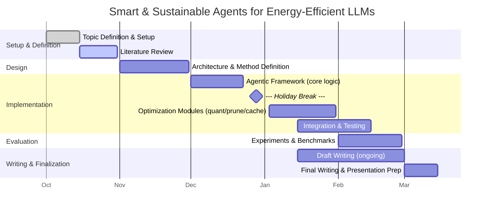

# Master Thesis Plan  1
15.10.25
**Title:** Sustainable Agents for Energy-Efficient LLMs
**Duration:** Oct 1, 2025 – Mar 31, 2026  
**Student:** Rui Vieira  (vieirrui@students.zhaw.ch), ZHAW
**Supervisor:** 
	Prof. Shuo-Yan CHOU (sychou@g.ecc.u-tokyo.ac.jp), NTUST
	Prof. Stefan Czerner (czer@zhaw.ch), ZHAW  
**Goal:** Develop agentic mechanisms to dynamically optimize model usage, energy, and hardware footprint of local LLMs — toward sustainable, democratized AI.

---

## 1. Introduction & Motivation
- Context: democratization of AI, local models, sustainability.
- Problem: LLMs are computationally and energetically heavy.
- Objective: design *smart, sustainable agents* to reduce energy and hardware needs.
- Scope: edge devices (e.g., Raspberry Pi, Mac M-series).
- Deliverables: agentic framework + evaluation on quantized/pruned LLMs.

---

## 2. Literature & State of the Art (Oct)
- Review of:
  - Quantization, pruning, caching, hardware-aware scheduling.
  - Agentic systems and adaptive model routing.
  - Edge inference benchmarks (energy, latency, accuracy tradeoffs).
- Comparative study of edge LLM techniques (e.g., Phi-3, Mistral, Qwen2-1.5B).

---

## 3. System Definition & Architecture (Nov)
- Define baseline system (LLM stack, dataset, metrics).
- Concept of *agentic process*:
  - Adaptive model selection.
  - Recursive micro-model reasoning.
  - Context-aware caching / modular execution.
- Draft architecture: local agent orchestrator + lightweight inference engine.

---

## 4. Implementation Phase (Dec–Jan)
- Implement and prototype:
  - Model selection agent (load balancing by complexity/energy).
  - Hardware resource allocation layer (CPU/GPU offloading, caching).
  - Dynamic quantization or pruning modules.
- Integrate with measurement tools (power draw, latency, RAM).

---

## 5. Evaluation & Experimentation (Feb)
- Compare configurations:
  - Baseline vs. agentic optimization.
  - Quantized vs. full-precision models.
- Metrics:
  - Energy efficiency (J/inference, W load).
  - Latency.
  - Accuracy/response quality.
  - Flexibility and scalability.

---

## 6. Discussion & Conclusion (Feb–Mar)
- Analyze trade-offs and potential for scaling.
- Discuss limits, sustainability impacts, and generalization potential.
- Conclude on future directions: adaptive micro-agents, model co-learning.

---

## 7. Thesis Writing & Finalization (Mar)
- Draft writing: ongoing from Jan.
- Final writing & revisions: Mar 1–15.
- Deliverables:
  - Written report.
  - Prototype codebase & documentation.
  - Presentation material.

---

## 8. Deliverables Summary
| Deliverable | Description | Due |
|--------------|--------------|-----|
| D1 | Literature review summary | Oct 31 |
| D2 | Architecture specification | Nov 30 |
| D3 | Prototype v1 | Dec 31 |
| D4 | Experiments & metrics | Feb 15 |
| D5 | Final report & presentation | Mar 15 |

---
# Feedback 1 
24.10.25
we understood the pipeline. we spend some time working and learning about llms but the work will lay on a other level rather the rag around the llm and not the llm itself (unless ?)

goal now : is to analyse where the system is

1) test the system localy, make it run → PRIO 1 Actually so far it does run ! @Isaqh is doing the docker for us to run it. 
   - then we need to make a clone and add measuring points 
   - can we help isaqh
1) chose / evaluate metrics of measure ? How should the benchmark be conducted ? Which queries ? 
2) where is the system heavy (biggest gains first) ??
3) how can we implemented agents in these ?
4) keep learning about agents  and NLP !!! WAKE UP LETS GO
5) think about global costs of the system (infra + capex + etc)

To do after 
- research based on the weak points 
	1) what we could do to correct 
	2) hot to rethink the architecture to implement an agent there
- 