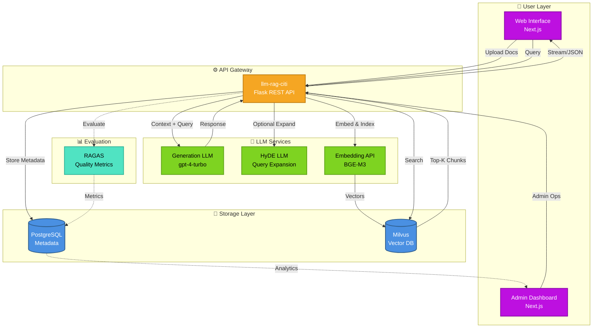
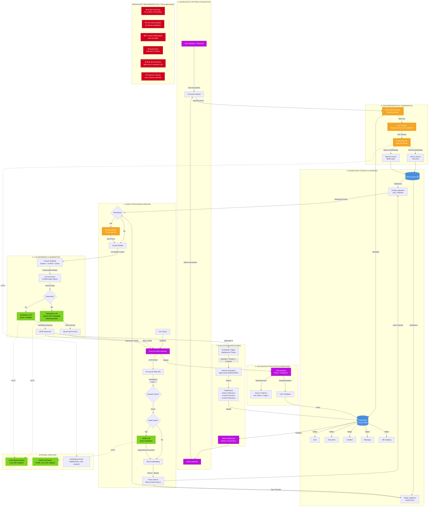
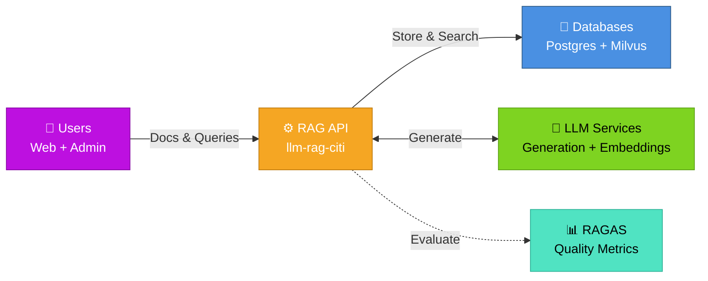
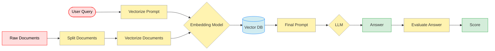

improv# 1 overview flowchart

```mermaid
flowchart TB

subgraph USER["👤 User Layer"]

U1[Web Interface<br/>Next.js]

U2[Admin Dashboard<br/>Next.js]

end

  

subgraph API["⚙️ API Gateway"]

API1[llm-rag-citi<br/>Flask REST API]

end

  

subgraph STORAGE["💾 Storage Layer"]

DB1[(PostgreSQL<br/>Metadata)]

DB2[(Milvus<br/>Vector DB)]

end

  

subgraph LLM["🤖 LLM Services"]

LLM1[Generation LLM<br/>gpt-4-turbo]

LLM2[HyDE LLM<br/>Query Expansion]

EMB[Embedding API<br/>BGE-M3]

end

  

subgraph EVAL["📊 Evaluation"]

RAGAS[RAGAS<br/>Quality Metrics]

end

  

%% Main Flow

U1 -->|Upload Docs| API1

U2 -->|Admin Ops| API1

  

API1 -->|Store Metadata| DB1

API1 -->|Embed & Index| EMB

EMB -->|Vectors| DB2

  

U1 -->|Query| API1

API1 -->|Optional Expand| LLM2

API1 -->|Search| DB2

DB2 -->|Top-K Chunks| API1

API1 -->|Context + Query| LLM1

LLM1 -->|Response| API1

API1 -->|Stream/JSON| U1

  

API1 -.->|Evaluate| RAGAS

RAGAS -.->|Metrics| DB1

DB1 -.->|Analytics| U2

  

classDef user fill:#BD10E0,stroke:#8B0AA8,color:#fff,stroke-width:2px

classDef api fill:#F5A623,stroke:#C17D11,color:#fff,stroke-width:2px

classDef storage fill:#4A90E2,stroke:#2E5C8A,color:#fff,stroke-width:2px

classDef llm fill:#7ED321,stroke:#5FA319,color:#000,stroke-width:2px

classDef eval fill:#50E3C2,stroke:#2EB398,color:#000,stroke-width:2px

  

class U1,U2 user

class API1 api

class DB1,DB2 storage

class LLM1,LLM2,EMB llm

class RAGAS eval
```
# 2 detail flowchart

```mermaid
flowchart TB

subgraph "1. KNOWLEDGE CAPTURE & ACQUISITION"

U1[User Interface - Front-end]

U2[Admin Interface]

U3[Document Upload]

U1 -->|User Documents| U3

U2 -->|Admin Documents| U3

end

subgraph "2. DATA PREPARATION & TOKENIZATION"

U3 -->|PDF/DOC/PPT| DOC_PROC[Document Processor<br/>MinERU/PyPDF]

DOC_PROC -->|Raw Text| CHUNK[Text Chunker<br/>RecursiveCharacterTextSplitter]

CHUNK -->|Text Chunks| EMB_API[Embedding API<br/>BGE-M3 Model]

EMB_API -->|Dense Embeddings| DENSE[Dense Vectors<br/>1024-dim]

EMB_API -->|Sparse Embeddings| SPARSE[Sparse Vectors<br/>BM25-style]

end

subgraph "3. KNOWLEDGE STORAGE & INDEXING"

DENSE --> MILVUS[(Milvus Vector DB)]

SPARSE --> MILVUS

MILVUS -->|Collections| PRIV[Private Collection<br/>user_id filtered]

MILVUS -->|Collections| PUB[Public Collection<br/>shared docs]

DOC_PROC -->|Metadata| POSTGRES[(PostgreSQL<br/>Prisma ORM)]

POSTGRES -->|Tables| T1[User]

POSTGRES -->|Tables| T2[Document]

POSTGRES -->|Tables| T3[ChatBox]

POSTGRES -->|Tables| T4[Message]

POSTGRES -->|Tables| T5[vdb mapping]

end

subgraph "4. QUERY PROCESSING PIPELINE"

USER[User Query] -->|Question| FE[Front-end Web Interface]

FE -->|HTTP POST| API[llm-rag-citi Flask API]

API -->|Semaphore<br/>max=2| QUEUE{Request Queue}

QUEUE -->|Query| HYDE_DECISION{HyDE Mode?}

HYDE_DECISION -->|Yes| HYDE_LLM[HyDE LLM<br/>Query Expansion]

HYDE_DECISION -->|No| EMB_QUERY[Direct Embedding]

HYDE_LLM -->|Hypothetical Document| EMB_QUERY

EMB_QUERY -->|Dense + Sparse| VEC_SEARCH[Vector Search<br/>Milvus Hybrid Search]

VEC_SEARCH -->|Top-K Results| PRIV

VEC_SEARCH -->|Top-K Results| PUB

PRIV -->|Retrieved Chunks| RERANK_CHECK{Reranking?}

PUB -->|Retrieved Chunks| RERANK_CHECK

RERANK_CHECK -->|Yes| RERANK[Reranker Model<br/>Cross-encoder]

RERANK_CHECK -->|No| CONTEXT_BUILD[Context Builder]

RERANK -->|Top-5 Docs| CONTEXT_BUILD

end

subgraph "5. LLM INFERENCE & GENERATION"

CONTEXT_BUILD -->|Formatted Context| PROMPT_TEMPLATE[Prompt Template<br/>System + Context + Query]

PROMPT_TEMPLATE -->|Conversation History| HISTORY[Format History<br/>ChatMessage objects]

HISTORY -->|Final Prompt| LLM_ROUTER{Streaming?}

LLM_ROUTER -->|Yes| STREAM_LLM[Generation LLM<br/>OpenAI API Compatible<br/>Streaming Mode]

LLM_ROUTER -->|No| SYNC_LLM[Generation LLM<br/>Async Complete]

STREAM_LLM -->|Token Stream| SSE[Server-Sent Events]

SYNC_LLM -->|Complete Response| JSON_RESP[JSON Response]

SSE -->|data: chunks| FE

JSON_RESP --> FE

end

subgraph "6. KNOWLEDGE APPLICATION & RESPONSE"

FE -->|Display| CHAT_UI[Chat Interface<br/>React + Markdown]

CHAT_UI -->|Retrieved Docs| SOURCE_DISPLAY[Source Citations<br/>Doc Name + Page #]

CHAT_UI -->|Rating/Feedback| FEEDBACK[User Feedback]

FEEDBACK -->|Store| POSTGRES

end

subgraph "7. EVALUATION & MONITORING"

JSON_RESP -->|Message ID| EVAL_TRIGGER[Evaluation Trigger<br/>Background Thread]

EVAL_TRIGGER -->|Question + Answer + Contexts| RAGAS[RAGAS Evaluation<br/>ragas-local-implementation]

RAGAS -->|Metrics| METRICS[Faithfulness<br/>Answer Relevancy<br/>Context Precision<br/>Context Relevance]

METRICS -->|Update| POSTGRES

POSTGRES -->|Analytics| ADMIN_DASH[Admin Dashboard<br/>Metrics Visualization]

ADMIN_DASH --> U2

end

subgraph "EXTERNAL SERVICES"

LLM_ENDPOINT[LLM Inference Server<br/>LLM_URL endpoint]

HYDE_ENDPOINT[HyDE LLM Server<br/>HYDE_LLM_URL endpoint]

EMB_ENDPOINT[Embedding Server<br/>EMBEDDING_URL endpoint]

STREAM_LLM -.->|HTTP| LLM_ENDPOINT

SYNC_LLM -.->|HTTP| LLM_ENDPOINT

HYDE_LLM -.->|HTTP| HYDE_ENDPOINT

EMB_API -.->|HTTP| EMB_ENDPOINT

end

subgraph "MISSING/NOT IMPLEMENTED (from LLM fundamentals)"

MISSING1[❌ Model Pretraining<br/>No custom LLM training]

MISSING2[❌ Fine-tuning Pipeline<br/>No domain adaptation]

MISSING3[❌ KV Cache Optimization<br/>Not controlled]

MISSING4[❌ Quantization<br/>External to system]

MISSING5[❌ Multi-head Attention<br/>Black box in external LLM]

MISSING6[❌ Tokenizer Training<br/>Uses external tokenizer]

end

classDef storage fill:#4A90E2,stroke:#2E5C8A,color:#fff

classDef processing fill:#F5A623,stroke:#C17D11,color:#fff

classDef llm fill:#7ED321,stroke:#5FA319,color:#000

classDef interface fill:#BD10E0,stroke:#8B0AA8,color:#fff

classDef missing fill:#D0021B,stroke:#8A0112,color:#fff

class MILVUS,POSTGRES storage

class DOC_PROC,CHUNK,EMB_API,RERANK processing

class HYDE_LLM,STREAM_LLM,SYNC_LLM,LLM_ENDPOINT,HYDE_ENDPOINT llm

class U1,U2,FE,CHAT_UI,ADMIN_DASH interface

class MISSING1,MISSING2,MISSING3,MISSING4,MISSING5,MISSING6 missing
```

# 3 simplistic flowchart

```mermaid
flowchart LR
    A[👤 Users<br/>Web + Admin] -->|Docs & Queries| B[⚙️ RAG API<br/>llm-rag-citi]
    B -->|Store & Search| C[💾 Databases<br/>Postgres + Milvus]
    B <-->|Generate| D[🤖 LLM Services<br/>Generation + Embeddings]
    B -.->|Evaluate| E[📊 RAGAS<br/>Quality Metrics]
    
    classDef layer1 fill:#BD10E0,stroke:#8B0AA8,color:#fff
    classDef layer2 fill:#F5A623,stroke:#C17D11,color:#fff
    classDef layer3 fill:#4A90E2,stroke:#2E5C8A,color:#fff
    classDef layer4 fill:#7ED321,stroke:#5FA319,color:#000
    classDef layer5 fill:#50E3C2,stroke:#2EB398,color:#000
    
    class A layer1
    class B layer2
    class C layer3
    class D layer4
    class E layer5
```

# 4 Query Pepeline 

```mermaid
flowchart LR
    B([User Query]) --> C[Vectorize Prompt]
    C --> D{Embedding Model}
    D --> E[(Vector DB)]
    E --> F[Final Prompt]
    F --> G{LLM}
    G --> H[Answer]
    H --> I[Evaluate Answer]
    I --> J[Score]

    %% Right-hand branch for document preparation
    K[Raw Documents] --> L[Split Documents]
    L --> M[Vectorize Documents]
    M --> D

    %% Styling
    classDef input fill:#ffdddd,stroke:#ff0000,stroke-width:1px,color:#000;
    classDef process fill:#fff3b0,stroke:#999,stroke-width:1px;
    classDef db fill:#d1ecf1,stroke:#007bff,stroke-width:1px;
    classDef output fill:#d4edda,stroke:#28a745,stroke-width:1px;

    class A,B,K input;
    class C,D,E,F,G,H,I,J,L,M process;
    class E db;
    class H,J output;
```

